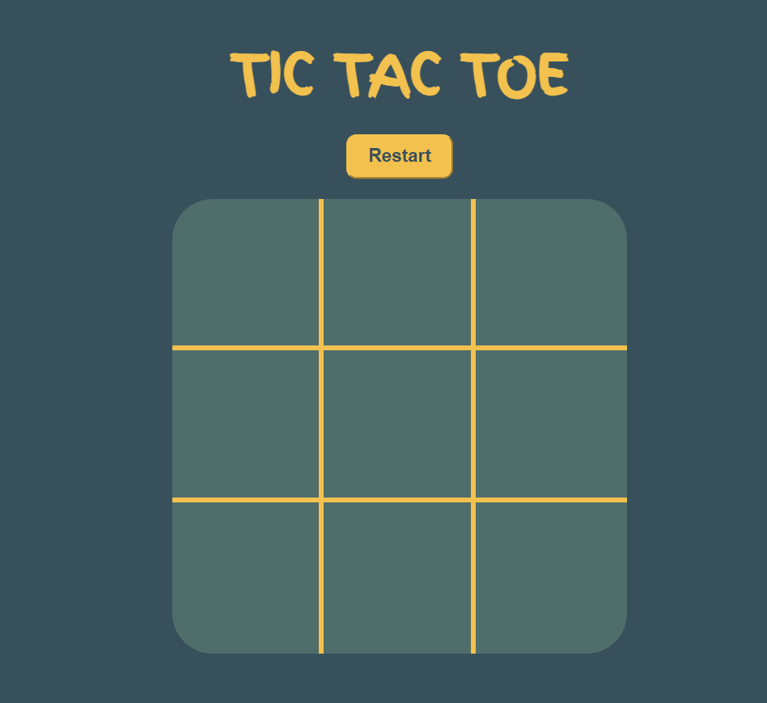
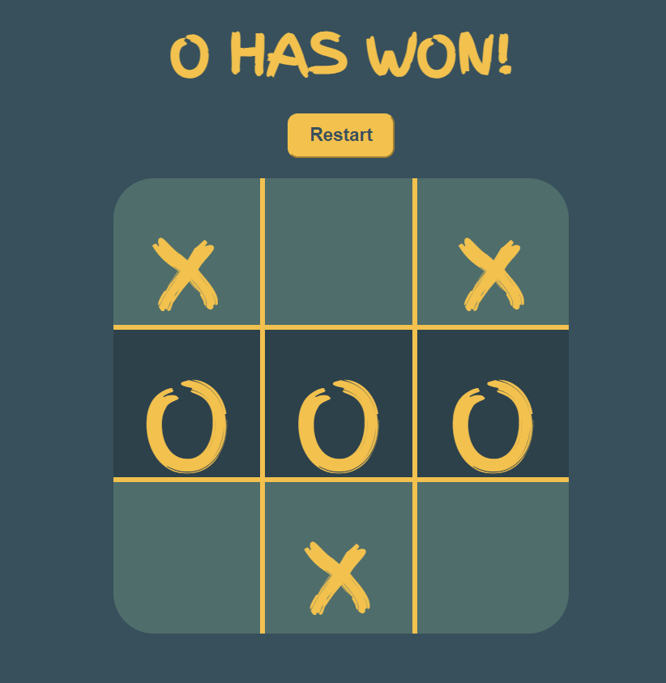

# 🎮 Tic Tac Toe Game

A simple **Tic Tac Toe** game built using **JavaScript, HTML, and CSS**. This project allows two players to play Tic Tac Toe on a 3x3 grid, with a restart button to start a new game and visual indications for winning moves.

## 🚀 Features

- **Two-player gameplay**: Players alternate turns until one wins or the game ends in a draw.
- **Win detection**: The game automatically detects a winner and highlights the winning combination.
- **Restart button**: Quickly reset the game without refreshing the page.
- **Responsive design**: The game is styled to look great on any screen size.

## 📝 How to Play

1. Open the `index.html` file in your web browser.
2. Players take turns clicking on the grid to place their marks.
3. When a player wins, the game highlights the winning blocks.
4. Click the **Restart** button to reset the game and play again.

## 🔧 Installation

1. Clone this repository to your local machine.
2. Open `index.html` in your browser to start playing.

## 📸 Screenshots

## 📸 Screenshots

### Game Start Screen

### Winning Move

## 🛠️ Technologies Used

- **HTML**: For the game structure.
- **CSS**: For styling the game board and elements.
- **JavaScript**: For implementing the game logic and interaction.

## 🤝 Contributing

Contributions are welcome! If you find any issues or want to improve the game, feel free to submit a pull request.

## 📜 License

This project is licensed under the MIT License. See the [LICENSE](LICENSE) file for details.
